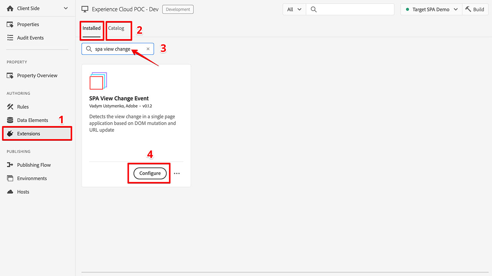
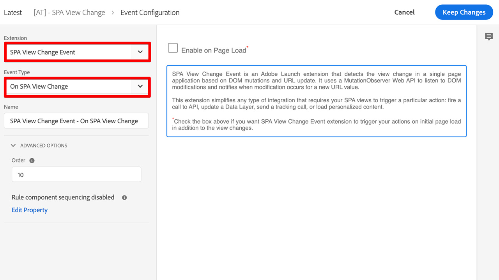
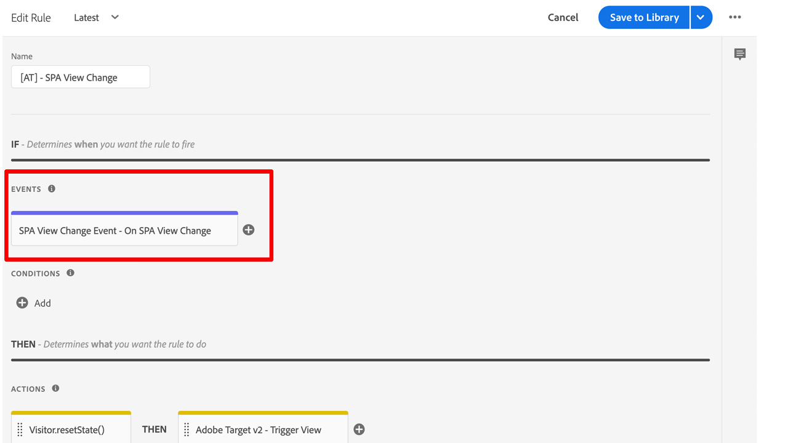
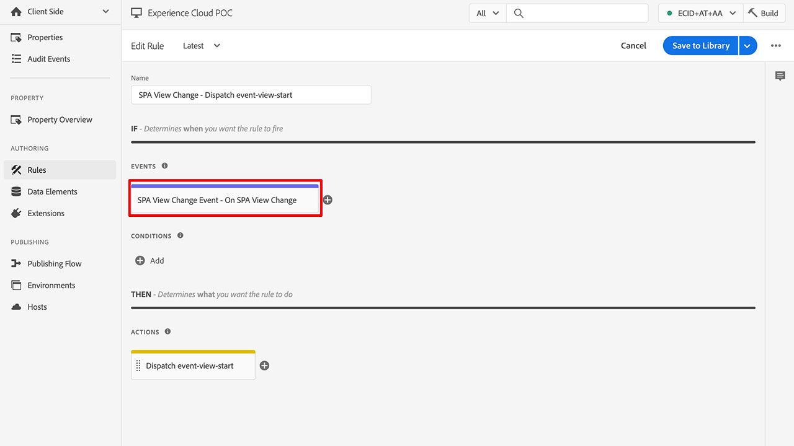

## SPA View Change Event
### Adobe Launch Extension Documentation

**SPA View Change Event** is an Adobe Launch extension that detects the view change in a single page application based on DOM mutations and URL update. It uses a MutationObserver Web API to listen to DOM modifications and notifies when modification occurs for a new URL value.

This extension simplifies any type of integration that requires your SPA views to trigger a particular action: fire a call to API, update a Data Layer, send a tracking call, or load personalized content.

## Installation

## Support

Please open an Issue in this GitHub repository for any support.